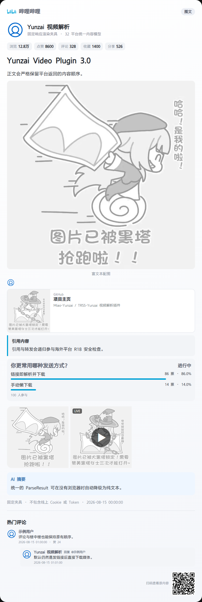
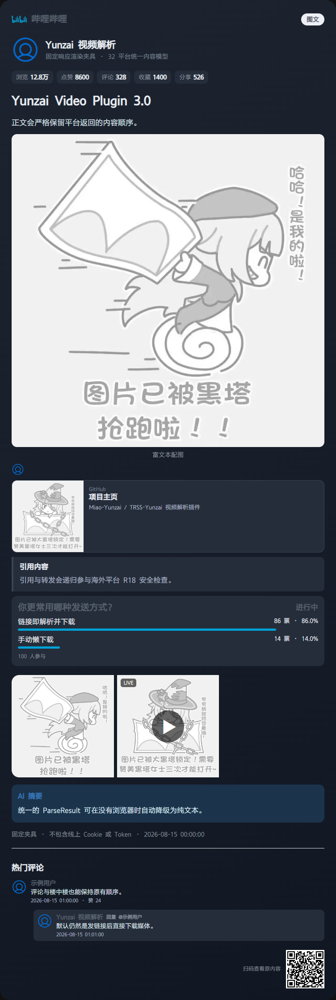

<div align="center">

# Yunzai Video Plugin

### ✨ 面向 Miao-Yunzai / TRSS-Yunzai 的链接分享自动解析插件 ✨

[](https://nodejs.org/)
[](https://developer.mozilla.org/docs/Web/JavaScript)
[](https://github.com/yoimiya-kokomi/Miao-Yunzai)
[](https://github.com/TimeRainStarSky/Yunzai)
[](https://github.com/help660vip/Yunzai-video-plugin/stargazers)
[](https://github.com/help660vip/Yunzai-video-plugin/issues)
[](LICENSE)

[项目主页](https://github.com/help660vip/Yunzai-video-plugin)
· [问题反馈](https://github.com/help660vip/Yunzai-video-plugin/issues)
· [安装](#-安装)
· [配置](#️-配置)
· [开发](#-开发)

</div>

> [!IMPORTANT]
>
> 严禁将本项目用于任何非法用途。请遵守所在地法律法规、内容平台服务协议和著作权规则，并仅处理你有权下载、保存或传播的内容。
>
> 因使用不当造成的一切责任由使用者承担，本项目维护者不承担相关责任。本项目与下列平台不存在隶属、授权或合作关系。

这是一个纯 JavaScript 的 Yunzai 插件，不需要 Python 或 NoneBot。安装后直接向机器人发送受支持的链接或 QQ 分享卡片，插件会解析信息并下载、发送其中的媒体；“懒下载”是可选模式，默认关闭。

## 📉 支持的平台

| 平台 | 图文 | 评论 | 视频 | Live Photo | 音频 / 音乐 |
| :--- | :---: | :---: | :---: | :---: | :---: |
| **B站** | ✓ | ✓ | ✓ | ✓ | ✓ |
| **抖音** | ✓ | ✓ | ✓ | ✓ | ✓ |
| **快手** | ✓ | ✓ | ✓ | — | ✓ |
| **微博** | ✓ | ✓ | ✓ | ✓ | ✓ |
| **小红书 / RedNote** | ✓ | ✓ | ✓ | ✓ | ✓ |
| **X / Twitter** | ✓ | — | ✓ | — | ✓ |
| **AcFun** | ✓ | — | ✓ | — | ✓ |
| **百度贴吧** | ✓ | ✓ | ✓ | — | ✓ |
| **知乎** | ✓ | ✓ | ✓ | — | ✓ |
| **堆糖** | ✓ | ✓ | — | — | — |
| **小黑盒** | ✓ | ✓ | ✓ | ✓ | ✓ |
| **LOFTER** | ✓ | ✓ | — | — | ✓ |
| **网易 BUFF** | ✓ | ✓ | — | — | — |
| **酷安** | ✓ | ✓ | — | — | — |
| **虎扑** | ✓ | ✓ | ✓ | — | ✓ |
| **米游社** | ✓ | ✓ | ✓ | — | ✓ |
| **豆瓣** | ✓ | ✓ | — | — | — |
| **5EPlay** | ✓ | ✓ | ✓ | — | ✓ |
| **豆包** | — | — | ✓ | — | ✓ |
| **ILLU** | ✓ | ✓ | — | — | — |
| **Linux Do** | ✓ | ✓ | — | — | — |
| **完美世界电竞** | ✓ | ✓ | ✓ | — | ✓ |
| **壁吧专楼吧** | ✓ | ✓ | — | — | — |
| **TapTap** | ✓ | ✓ | ✓ | — | ✓ |
| **网易大神** | ✓ | ✓ | ✓ | — | ✓ |
| **NGA** | ✓ | ✓ | ✓ | — | ✓ |
| **YouTube** | ✓ | — | ✓ | — | ✓ |
| **TikTok** | ✓ | — | ✓ | — | ✓ |
| **网易云音乐** | ✓ | — | ✓ | — | ✓ |
| **酷狗音乐** | ✓ | — | ✓ | — | ✓ |
| **汽水音乐** | ✓ | — | ✓ | — | ✓ |
| **酷我音乐** | ✓ | — | ✓ | — | ✓ |

> **标识说明**
>
> - ✓：支持解析该类内容；具体可见内容仍受原平台权限、风控、Cookie 和分享页面限制。
> - —：该平台通常没有此内容形态，或插件未请求该模块。
> - “图文”包括动态、帖子、问答、文章、相册、链接卡、引用、投票和其他有序富文本。
> - `twitter` / `xiaohongshu` 是稳定的平台标识；配置中也接受 `x` / `rednote`，`5eplay` 会映射为 `fiveeplay`。

## 📦 安装

### 环境要求

| 项目 | 要求 | 用途 |
| :--- | :--- | :--- |
| Yunzai | Miao-Yunzai 或 TRSS-Yunzai | 插件运行环境 |
| Node.js | `>= 16.14` | JavaScript 运行环境 |
| pnpm | 跟随 Yunzai 环境 | 安装依赖 |
| Chrome / Chromium + Puppeteer | 推荐 | 渲染富文本信息卡 |
| FFmpeg | 推荐，并加入 `PATH` | 音视频合并、转码、Live Photo |
| yt-dlp | YouTube / TikTok / `ym` 需要 | 获取海外平台音视频 |

在 Yunzai 根目录执行：

```bash
git clone --depth=1 https://github.com/help660vip/Yunzai-video-plugin.git ./plugins/yunzai-video-plugin
pnpm --dir ./plugins/yunzai-video-plugin install
```

然后重启 Yunzai。可用下面的命令检查可选程序是否已加入运行 Yunzai 的用户环境：

```bash
ffmpeg -version
yt-dlp --version
```

更新插件：

```bash
git -C ./plugins/yunzai-video-plugin pull
pnpm --dir ./plugins/yunzai-video-plugin install
```

## 🎁 特性

- 发链接即用：自动从普通文本、引用消息和 QQ JSON 分享卡片中提取链接，默认解析后立即下载并发送媒体。
- 32 个平台：统一处理短链、图文、视频、音乐、评论与楼中楼、贴纸、Live Photo、引用、投票、AI 摘要和链接卡。
- 有序富文本：文本、图片、视频、贴纸、链接与引用保持原有顺序，支持九宫格和长文本转发。
- 稳定下载：流式大小限制、重试、缓存、音视频分别上传、FFmpeg 合并，以及下载失败时的兼容降级。
- 丰富渲染：浅色 / 深色主题、统计、评论、投票、二维码和音乐卡；浏览器不可用时自动回退到纯文本。
- 可选懒下载：开启后先发送解析结果，只有用户发送配置的下载命令时才下载媒体，可设置提示和超时。
- 权限控制：群黑 / 白名单、用户黑名单、平台禁用列表，以及群管理员开启 / 关闭解析命令。
- 兼容扩展：保留旧版公共 API 和配置语义，其他 Yunzai 插件可继续注册自己的解析器。

<details>
<summary><strong>渲染效果</strong></summary>

固定测试夹具生成的实际渲染截图：

| 浅色主题 | 深色主题 |
| :---: | :---: |
|  |  |

`parser_render_type: default` 使用纯文本；`common`、`htmlrender` 使用 Puppeteer 信息卡；`htmlkit` 保留旧配置语义并在不可用时回退。Puppeteer 或浏览器启动失败时也会自动降级，不影响媒体发送。

</details>

## 🔞 海外平台 R18 拦截

R18 拦截默认开启，但**只检查配置列表内的海外平台**：`twitter`、`youtube`、`tiktok`。国内平台默认完全绕过 R18 和关键词判断，不会因为正文包含同类词语而被插件拦截。

- X / Twitter：命中 `possibly_sensitive`、成人警告或高置信 R18 标签时拦截。
- YouTube / TikTok：命中 `age_limit >= 18`、明确年龄限制或高置信 R18 / NSFW 标签时拦截。
- 引用和转发内容会递归检查，任意一层命中都会停止整条解析。
- 检查发生在封面、头像和媒体下载之前；命中后只回复：`检测到受限内容，已停止解析。`
- 拦截缓存是匿名标记，不会发送标题、封面、来源链接或具体命中原因。

> [!WARNING]
>
> 该功能依赖平台返回的元数据和文本标志，不调用外部图片审核服务。若平台未标记内容，且风险信息只存在于图片或视频画面中，仍可能漏判。它是降低误解析风险的安全门，不是内容审核服务。

要增减受检查的海外平台，请修改 `parser_r18_platforms`；不要把国内平台加入列表，除非你明确需要改变上述默认边界。

## ⚙️ 配置

配置文件位于 [`config/config.yaml`](config/config.yaml)，修改后重启 Yunzai。下方仅概览常用分组；完整字段、默认值和注释请展开或直接查看配置文件。

<details>
<summary><strong>完整配置说明</strong></summary>

| 分组 | 配置项 | 说明 |
| :--- | :--- | :--- |
| 凭据 | `parser_bili_ck`、`parser_ytb_ck`、`parser_xhs_ck`、`parser_zhihu_ck`、`parser_linuxdo_ck` | 对应平台 Cookie，可留空 |
| 网络 | `parser_proxy`、`parser_max_retries`、`parser_max_size`、`parser_duration_maximum` | 代理、重试及下载限制 |
| 发送 | `parser_need_upload*`、`parser_use_base64`、`parser_need_forward_contents` | 上传与消息发送方式 |
| 展示 | `parser_render_type`、`parser_day_range`、字体、Emoji、URL、二维码 | 信息卡和附加内容 |
| 下载 | `parser_lazy_download*`、`parser_download_command`、`parser_live_photo` | 懒下载及 Live Photo |
| 过滤 | `parser_disabled_platforms`、`parser_blacklist_users`、群名单、R18 配置 | 解析范围和安全门 |
| 平台 | B站画质 / 编码 / CDN 等 | 平台专用选项 |

默认是“直接解析并下载”：

```yaml
parser_lazy_download: false
```

如需先看解析卡、再由发送链接的用户决定是否下载：

```yaml
parser_lazy_download: true
parser_lazy_download_tip: true
parser_lazy_download_timeout: 30
parser_download_command:
  - xz
  - 下载
```

`parser_need_upload` 是兼容旧版的音视频总开关。配置文件中显式设置 `parser_need_upload_audio` 或 `parser_need_upload_video` 时，独立开关优先。

</details>

### Cookie 与数据安全

> [!WARNING]
>
> Cookie 具有账号权限，配置文件以明文存储。请勿截图分享、提交到 GitHub 或发送给不可信第三方；反馈问题前务必脱敏。

- `blogin` 获取的 B站凭据保存在 `data/bilibili_cookies.json`。
- YouTube Cookie 会转换到 `config/ytb_cookies.txt` 供 `yt-dlp` 使用。
- 群开关、媒体缓存和渲染缓存位于 `data/`，插件每天 `01:00` 自动清理缓存。
- `data/` 被 Git 忽略，但 `config/config.yaml` 会被版本控制追踪，不要写入准备公开的真实凭据。

## 🎉 使用

默认无需命令：直接发送链接或分享卡片，插件会发送信息卡并下载媒体。

| 命令 | 参数 | 权限 / 场景 | 说明 |
| :--- | :--- | :--- | :--- |
| `@机器人 开启解析` | 无 | 主人 / 群主 / 管理员，群聊 | 在当前群名单模式下开启解析 |
| `@机器人 关闭解析` | 无 | 主人 / 群主 / 管理员，群聊 | 在当前群名单模式下关闭解析 |
| `bm BV号 [分P]` | BV 号，可选分P序号 | 全部用户 | 提取 B站音频并发送语音 |
| `ym YouTube链接` | YouTube 链接 | 全部用户，需 `yt-dlp` | 提取 YouTube 音频并发送语音 |
| `blogin` | 无 | 仅主人私聊 | 扫码获取并保存 B站凭据 |
| `xz` / `下载` | 无 | 开启懒下载后、原请求用户 | 下载最近一次等待中的解析媒体 |

群名单逻辑：

- `parser_group_blacklist_enabled: true`：群黑名单模式，默认所有群开启，名单内关闭。
- `parser_group_blacklist_enabled: false`：群白名单模式，默认所有群关闭，名单内开启。
- 用户黑名单 `parser_blacklist_users` 优先于群名单。

## 🧩 自定义解析器

其他 Yunzai 插件可以从 [`lib/public.js`](lib/public.js) 导入公共模型、`Creator`、`BaseParser` 和注册器。旧版 `ParseResult`、`PathTask`、`contents`、`text`、`graphics` 调用方式继续有效；新解析器可使用有序 `content`、评论、统计、投票、贴纸和 Live Photo。

```js
import { BaseParser, registerParser } from "../yunzai-video-plugin/lib/public.js"

class ExampleParser extends BaseParser {
  static platform = { name: "example", displayName: "示例" }
  static handlers = [{
    keyword: "example.com",
    pattern: /example\.com\/video\/(?<id>\w+)/,
    method: "parse",
  }]

  async parse(match) {
    return this.result({
      title: match.groups.id,
      author: this.createAuthor("示例作者"),
      content: [this.createVideo("https://example.com/video.mp4")],
    })
  }
}

registerParser(ExampleParser)
```

## 🛠 开发

```bash
pnpm install
pnpm run check
pnpm test
git diff --check
```

主要目录：

```text
.
├─ index.js          # Yunzai 插件入口、命令与定时任务
├─ config/           # 用户配置
├─ lib/core/         # 模型、注册、下载、缓存、安全与消息适配
├─ lib/parsers/      # 32 个平台解析器
├─ lib/render/       # 纯文本与 Puppeteer 信息卡渲染
├─ resources/        # 字体、图标和兜底资源
├─ scripts/          # 开发检查脚本
└─ tests/            # 固定夹具与自动化测试
```

提交问题时，请提供 Yunzai / Node.js / FFmpeg / `yt-dlp` 版本、链接类型和已脱敏的完整日志。请勿公开 Cookie、Token、QQ 号或其他敏感信息。

## 🎊 致谢

- [sokoko-org/nonebot-plugin-parser-lite](https://github.com/sokoko-org/nonebot-plugin-parser-lite)：本次多平台能力、有序富文本模型与文档结构的重要上游参考。
- [fllesser/nonebot-plugin-parser](https://github.com/fllesser/nonebot-plugin-parser)：社交媒体分享链接解析项目。
- [LoCCai/nonebot-plugin-parser-m](https://github.com/LoCCai/nonebot-plugin-parser-m)：多平台解析实现参考。
- [lumina37/aiotieba](https://github.com/lumina37/aiotieba)：贴吧协议与接口参考。
- [ikenxuan/karin-plugin-kkk](https://github.com/ikenxuan/karin-plugin-kkk)：Yunzai 平台解析与信息卡设计参考。
- [ikenxuan/amagi](https://github.com/ikenxuan/amagi)：B站、抖音 Web 数据接口参考。
- [zly2006/zhihu-plus-plus](https://github.com/zly2006/zhihu-plus-plus)：知乎接口参考。
- [Uesugi Hanako](https://github.com/negichan) 及相关贡献者：渲染与签名算法参考。
- `molanp`、`Les Freire` 及所有上游贡献者。

本项目以 [MIT License](LICENSE) 发布。欢迎提交 Issue、Pull Request，或在 [GitHub](https://github.com/help660vip/Yunzai-video-plugin) 点一个 Star。
